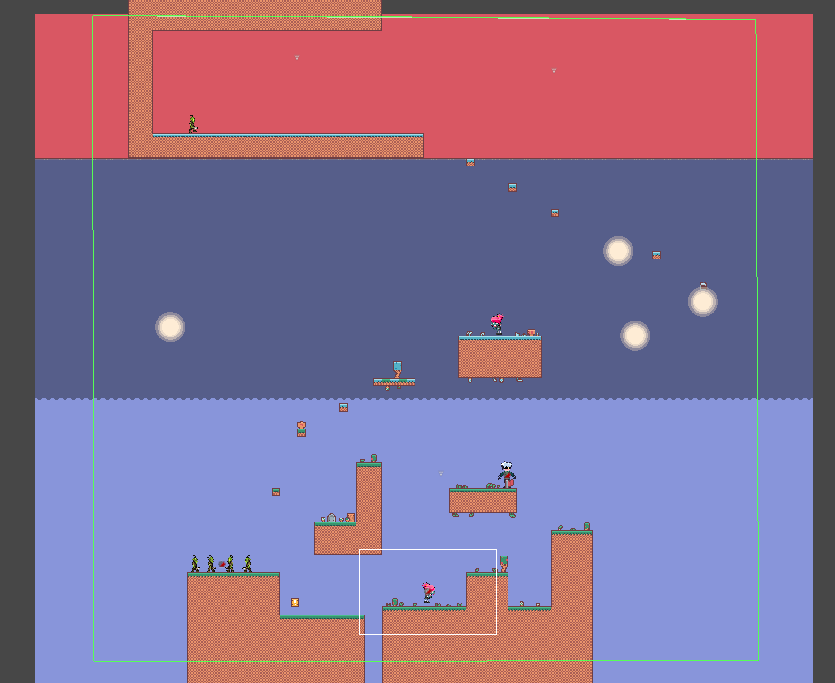
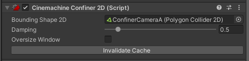
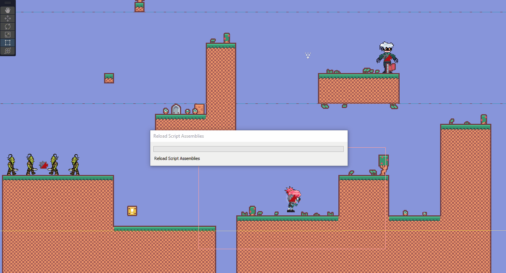
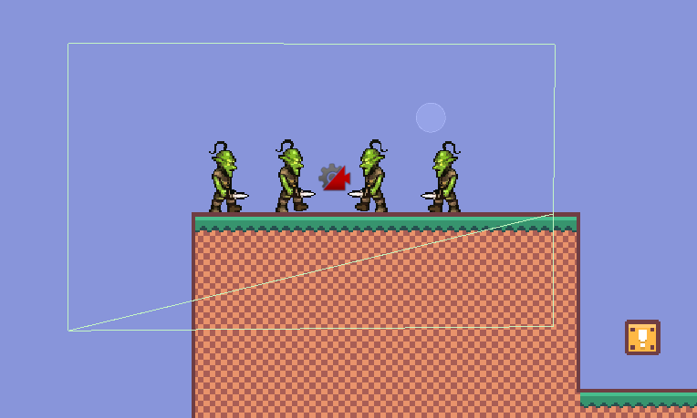
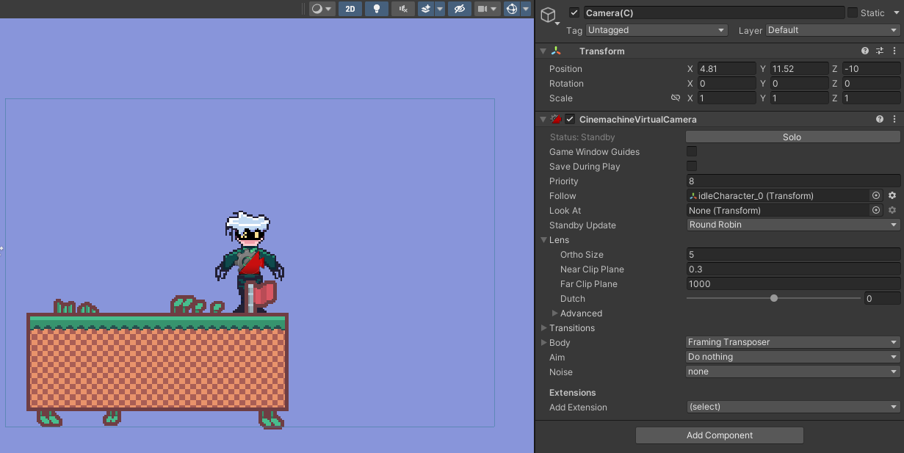

# Controlador de camara.
## Autor: Álvaro González Rodríguez
alu0101202556

1. Cámara (A) con seguimiento al jugador. Se debe configurar el seguimiento hacia adelante. Esta cámara es la que debe tener la máxima prioridad.

Se ha añadido una cámara virtual que sigue el movimiento del jugador. La cámara se mueve un poco hacia adelante cuando el jugador avanza en una dirección, esto se consigue con las variables Lookahead Time y Lookahead Smoothing de la cámara virtual.

2. Cámara (B) con seguimiento a un grupo de personajes que no sean el jugador. La zona donde no se activa el seguimiento debe ser mayor que la del personaje.

La segunda cámara virtual está enfocando a un grupo de goblins. Se ha creado un script para conseguir aumentar la pripridad de esta cámara cuando el jugador se acerca a una zona determinada, consiguiendo de esta manera enfocar al grupo de goblins

3. Crear una zona de confinamiento para la cámara A que abarque toda la escena.

Para conseguir esta finalidad se ha añadido un objeto vacio que posteriormente se le ha añadido un Polygon Collider 2D que abarca toda la escena. Luego se ha añadido la extensión Confiner 2D a la cámara del jugador

4. Se debe crear una zona de confinamiento de la cámara B que abarque una parte de la escena.

Se ha seguido el mismo procedimiento que en la cámara A, pero en esta ocación solo abarca una porción de la escena

5. Añadir un objeto que genere una vibración en la cámara cuando A choca con él.

Se ha agragado un objeto en la escena con un collider y rigidbody junto con un script de la cinemachine que crea un impulso. También ha sido necesario añadir un listener a la cámara que aplica ese ruido al chocar con el objeto

6. Agregar una tercera cámara (C) que siga a un personaje que no sea el jugador (sólo uno).

Simplemente se ha agregado otra cámara virtual a la escena la cual sigue a un personaje de la escena

7. Seleccionar un conjunto de teclas que permitan hacer el cambio entre las cámaras A y C . (Habilitar/Deshabilitar el gameobject de la cámara virtual)

Se ha creado un script que se ha asignado a la cámara principal. Cuando se pulsa la tecla L se le da máxima prioridad a la cámara C y cuando se deja de pulsar se le devuelve la máxima prioridad a la cámara A

8. Generar una vibración en la cámara cada vez que se pulse la tecla de disparo. Agregar un perfil de ruido a la cámara, y modificar las propiedades de amplitud y frecuencia al component Noise

Se ha agregado un script a la cámara virtual A para que esta pueda vibrar cuando se llame a una función determinada. Luego, en la acción de atacar del jugador, se llama a esa función, consiguiendo un efecto de vibración
